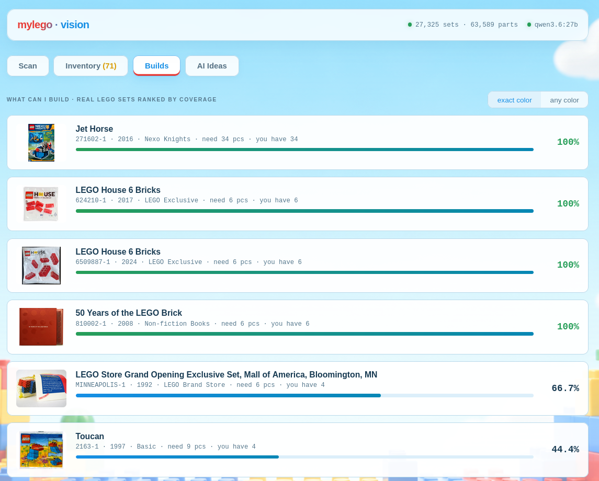
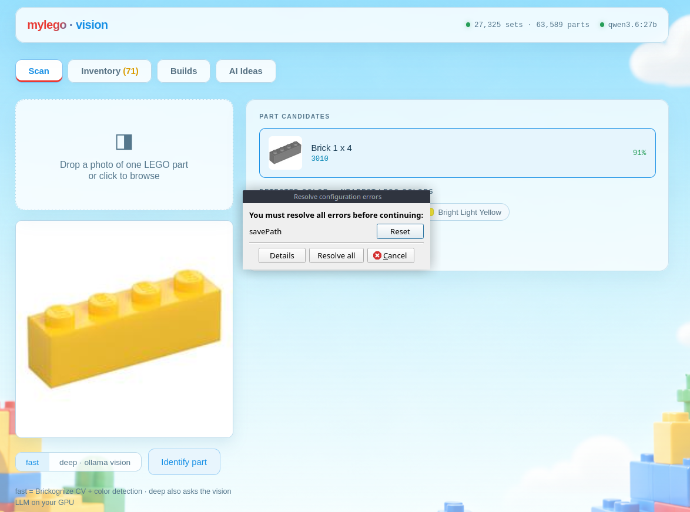
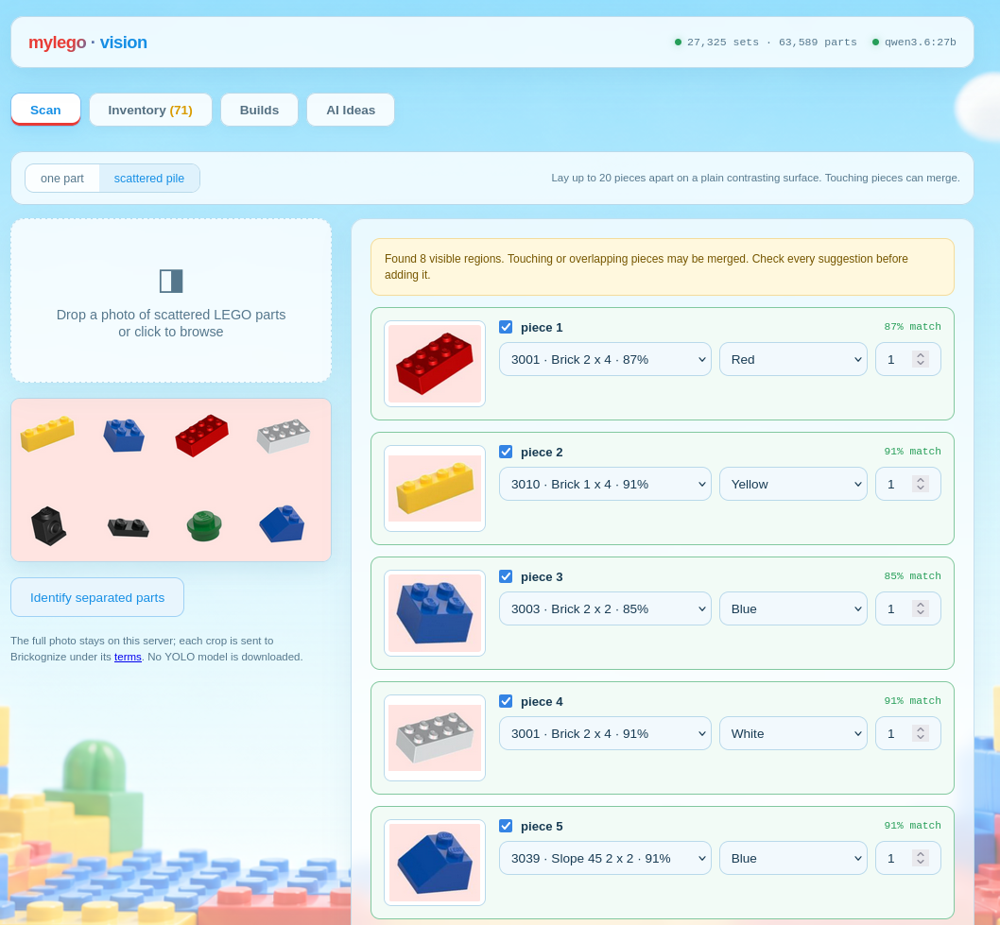
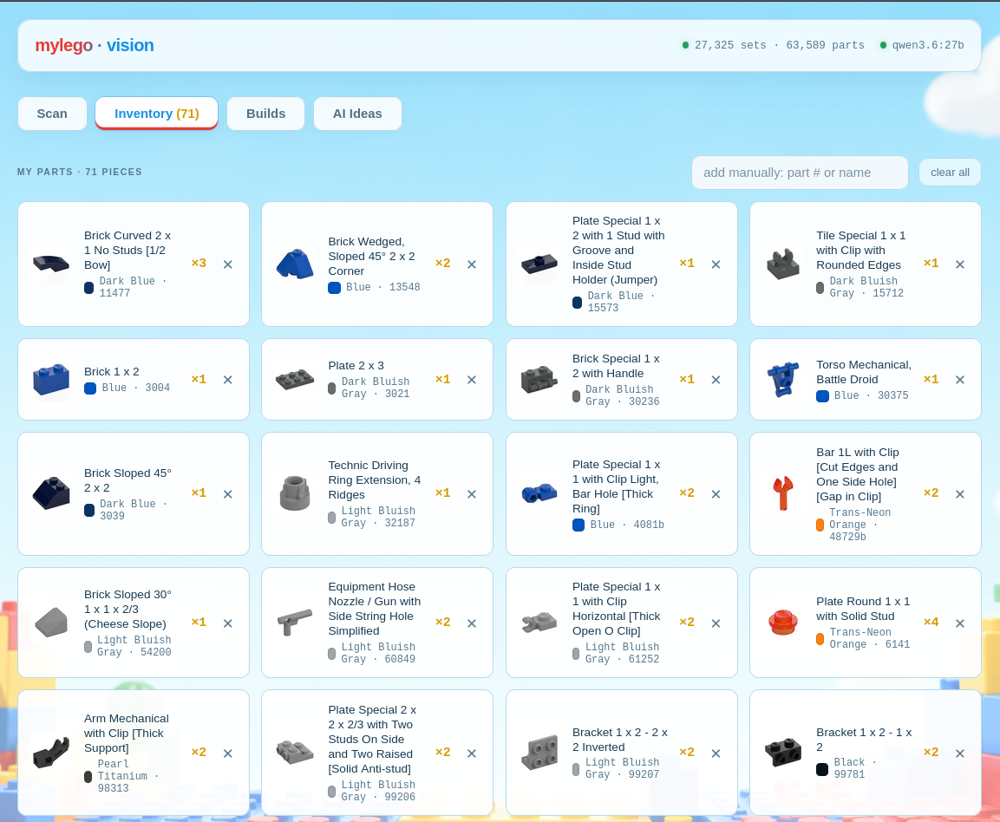
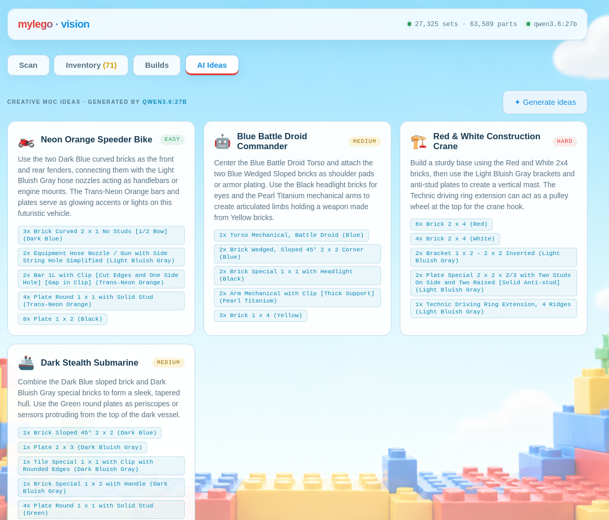

# mylego · vision

    

What can I build from my pile of LEGO parts?    
Scan parts with computer vision -> keep an inventory -> rank every real LEGO set by buildability -> ask a local LLM for creative MOC ideas.   

## Architecture

```bash
single-part photo --> Brickognize API (part id, free CV service trained on all LEGO parts)
      --> local dominant-color -> nearest LEGO color (Rebrickable palette)
      --> optional: Ollama vision LLM (qwen3.6:27b on the GPU box) second opinion
                                    │
scattered-parts photo --> local Pillow background separation --> one crop per piece
                                    --> Brickognize API per crop
                                    │
                                    ▼
        SQLite (lego.db) <-- Rebrickable full dataset (~27k sets, 63k parts,
                             1.5M inventory rows, precomputed set_parts)
                                    │
        my_parts inventory ---------┤
                                    ▼
        buildability engine: SUM(MIN(need, have)) / SUM(need) per set
        (strict = exact color match, loose = shape only)
                                    │
                                    ▼
        AI advisor: Ollama text LLM invents MOCs from your actual parts
```

## Quick start

```sh
python3 -m venv .venv && .venv/bin/pip install -r requirements.txt
python3 ingest.py                     # downloads Rebrickable dumps -> lego.db (~1 min)
.venv/bin/uvicorn main:app --host 0.0.0.0 --port 8500
# open http://localhost:8500
```

To rebuild only the derived buildability tables from an existing database
(without downloading the dataset again), run:

```sh
python3 ingest.py --precompute-only
```

Config in `.env`:

```bash
OLLAMA_HOST=http://10.10.10.100:11434     # your GPU box address (Nvidia)
OLLAMA_VISION_MODEL=qwen3.6:27b           # any vision-capable ollama model
OLLAMA_TEXT_MODEL=qwen3.6:27b
```

GPU vs CPU: all heavy AI runs on the Ollama host; this app itself is
CPU-only (SQLite + tiny Pillow color math) and runs anywhere. To go
fully-CPU later just point `OLLAMA_HOST` at a smaller local model
(e.g. `qwen3:4b` + a small vision model) - nothing else changes.

## Workflow

**Scan** has two explicit modes:

`one part` - Brickognize + local color detection; `deep` also asks the Ollama vision model.   

    

`scattered pile` - separates up to 20 visible, non-touching pieces on a plain contrasting surface, sends each crop to Brickognize, and lets you review every part/color before one atomic Inventory update. Touching or overlapping pieces can be merged and are deliberately not added without confirmation.    

The pile separator uses the existing Pillow dependency. It downloads no detector,
training dataset, or AGPL YOLO implementation.

    

**Inventory** - confirmed parts land in `my_parts` (part_num + color + qty).
Manual add by part number/name works, and a complete set you own can be imported
by set number after preview and confirmation.

        

**Builds** - every real LEGO set ranked by coverage: 100% buildable, 90%+
near-buildable, etc. Click a set to see a large assembled-model preview and the
parts that are still missing. `exact color` / `any color` modes.

    

**AI Ideas** - the local LLM suggests original small MOCs using only your parts.
If an idea exactly matches a real set in the local Rebrickable catalog, its original
CDN image is downloaded, verified, cached in SQLite, and offered for download. An
original MOC with no verified real photo gets a local LEGO-style placeholder instead;
the app never generates a replacement image. The cache keeps the latest 60 real images.

    

Sample photos to try:

- `test_images/brick-*.jpg`, `plate-*.jpg`, etc. - one-part Scan fixtures.
- `test_images/pile-*.jpg` - six multi-part fixtures with 3, 4, 5, 6, 8,
  and 10 separated pieces across landscape, portrait, square, sparse, and denser layouts.

## Tests

```bash
.venv/bin/python -m unittest discover -s tests -v
```

## API

| endpoint | what |
|---|---|
| `POST /api/scan?engine=fast\|deep` | identify a part on a photo |
| `POST /api/scan/pile?max_parts=1..20` | crop and identify separated parts on one photo |
| `GET/POST/DELETE /api/inventory` | my parts CRUD |
| `POST /api/inventory/bulk` | atomically add reviewed pile-scan results |
| `GET /api/sets/search?q=...` | find a set to preview/import |
| `POST /api/inventory/import-set/{set}` | add a complete owned set to inventory |
| `GET /api/buildable?mode=strict\|loose` | ranked buildable sets |
| `GET /api/buildable/{set}/missing` | missing-parts diff for a set |
| `POST /api/advise` | LLM MOC ideas from inventory |
| `POST /api/ideas/preview` | resolve/cache a verified real set image or placeholder |
| `GET /api/ideas/preview/{id}` | view or download a cached preview |
| `GET /api/status` | db + ollama health |

## Data & credits

- [Rebrickable](https://rebrickable.com/downloads/) - full LEGO catalog CSV dumps; review its current download terms before redistributing the database
- [Brickognize](https://brickognize.com) - free part-recognition API by Piotr Rybak
- Pillow-only connected-region separation is used for scattered photos; no third-party
  detector weights or LEGO training images are redistributed by this project.
